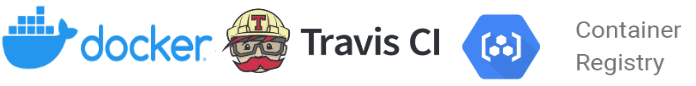

# Multistage docker build
 <br>

## Introduction
This is repository 1/2 of [exam in lecture pgr301 (Continuation exam)](https://github.com/Leifhaa/PGR301-2020-konte-oppgave2/tree/master/docs). Repository 2/2 can be found [here](https://github.com/Leifhaa/PGR301-2020-konte-oppgave2). This repository is forked from the original repository [here](https://github.com/PGR301-2020/konte). The original repository has the spring application located in `oppgave1-docker` directory. I have moved the application so it's now instead in the root of this directory.
* This repository answers task 1 of the exam.

## Prerequisites before running the guides:
* Installed Terraform (https://www.terraform.io/downloads.html)

# Task 1 - Docker 
## Task A
This project contains a multistaged docker file named `Dockerfile` for creating a Container Image of the spring boot application.<br />
For creating a docker image, open terminal in root directory and run:
```shell script
docker build . --tag konte
```

## Task B
In order to run a container of the newest container image, run the following command:
```shell script
docker run -d --name hello-konte -p 8080:9999  konte:latest
```
Here's a description of the arguments

| Argument | Description |
| --- | --- |
| -d | Run detached, means that docker container runs in the background of the terminal. |
| --name hello-konte | Assigns a name to the container, otherwise this name is randomly created. |
| -p 8080:9999 | Forwarding ports, so a request on 8080 to our machine, is forwarded to port 9999 in the container |
| konte:latest | Specifies which container image to run, following by which tag (latest in this case) |

In summary, this command will start a container of the latest image accessible on port 8080 on your local machine.

## Handling "404 not found"
The original code would return a "404 not found" whenever ran in container. Personally I experienced this due to `index.html` not being found inside the docker. This could be fixed in several ways:
### Option 1 - Adapting the docker file
Adding command for copying index.html file in stage 2 of the docker file as shown below:
``` diff
FROM adoptopenjdk/openjdk11:alpine-slim
WORKDIR /app
COPY --from=builder /app/target/*.jar application.jar
+ COPY index.html .                     
ENTRYPOINT ["java", "-jar", "application.jar"]
```
This will copy the `index.html` into the app directory as well, and our application is able to access index.html when running in docker

### Option 2 - Moving the index.html file
Moving the `index.html` file inside `src/main/resource/static` would include it in the .jar file and allow spring boot to serve the `index.html` by default. This means there's longer need for the controller to serve the `index.html`. This option requires no adjustments in the docker file

### Selecting an option
I chose option 2 and removed the logic from the controller as this was no longer necessary. I interpreted that we're allowed to do such architectural changes. If moving `index.html` would not be allowed, or changing the controller logic was not OK then option 2 would be out of scope. 
<br />
<br />
An argument for choosing option 2 is that I believe this is a more common way of serving static content, and this is how my previous classes has served static content. Anther reason why I chose option 2 is that Option 1 doesn't scale well. If I'd want to add a new .html file, I'd also have to add a new COPY command inside docker file which opens for more errors.

After these changes, I was able to run & view the index page on http://localhost:8080/

#### Other reasons for 404
There could also be other explainations why "404 not found" could occur when running the app in container. Some of the more common ones is:
- Trying to access http://localhost:9999/ instead of http://localhost:8080/ when application is running in docker
- Missing argument -p 8080:9999 when running ````docker run...```` 

# Travis & Google Container Registry
:information_source: *This is not a task in the exam. Completing this part is not necessary and can be skipped*. :information_source: <br />
 <br>
I decided to add an extension to the project, allowing travis to build the docker image for us and deploying it on Google. Here's a brief explanation of how. Before following this guide, it's important that you've already:
 -  Already Created a Google Project and Service Account. Otherwise, refer to [this guide](#https://github.com/Leifhaa/PGR301-2020-konte-oppgave2#guide-1-creating-a-google-cloud-project-and-google-service-account)

## 1. Edit Travis file
Open the `.travis.yml` located in the root directory. Insert your Google Cloud project ID
```diff
env:
  global:
-    - GCP_PROJECT_ID=decisive-mapper-306016
+    - GCP_PROJECT_ID=your-project-id
...
```

## 2. Append service account key file
Travis needs a key file in order authenticate and push the built image to google. Complete step 5 and 6 in [this guide](#https://github.com/Leifhaa/PGR301-2020-konte-oppgave2#5-encrypt-service-account-key-file) for adding a keyfile to travis, but replace ```terraform_keyfile.json``` with ```google_keyfile.json``` while completing the steps.

Todo: Må enable API's:
https://stackoverflow.com/questions/58733523/google-cloud-platform-warning-you-do-not-appear-to-have-access-to-project-pro